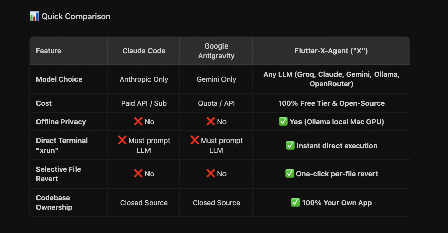

# Flutter-X-Agent 🚀
### Autonomous AI Workspace IDE & Codebase Agent with Hybrid RAG, Multi-Provider Tool Calling, and Dual-Model Adversarial Development

[](https://flutter.dev)
[](https://dart.dev)
[](https://flutter.dev/desktop)
[](#-multi-provider-llm-engine)
[](LICENSE)

---

**Flutter-X-Agent** is a next-generation desktop IDE and autonomous agentic workspace designed for production-grade pair programming. Built natively in Flutter Desktop, it connects directly to local repositories, indexes codebases with hybrid RAG, reads and mutates files with automatic rollback safety snapshots, runs live terminal commands in an integrated shell hub, and pioneers **Dual-Model Adversarial AI Development (Blue Team vs. Red Team)** for self-hardening code.

---

## ⚡ Quick Comparison



---

## ⚔️ NEW: Dual-Model Adversarial Development Agent (AI Arena)

Traditional single-model AI coding assistants often produce code with subtle race conditions, unhandled edge cases, memory leaks, or security vulnerabilities. **Flutter-X-Agent introduces a Multi-Model Adversarial Duel Engine** that pits two distinct LLMs against each other in real-time self-play until consensus is reached.

```
                  ┌──────────────────────────────────────────────┐
                  │          USER TASK / REFACTOR PROMPT         │
                  └──────────────────────┬───────────────────────┘
                                         │
                                         ▼
                 ┌────────────────────────────────────────────────┐
                 │ 🔵 BLUE TEAM (Lead Architect & Senior Builder) │
                 │ • Generates clean implementation & tests       │
                 │ • Refactors based on Red Team critique         │
                 └───────────────────────┬────────────────────────┘
                                         │
                         [Proposes Code Implementation]
                                         │
                                         ▼
                 ┌────────────────────────────────────────────────┐
                 │ 🔴 RED TEAM (Master Hacker & Security Critic)  │
                 │ • Hunts injection vectors & security flaws     │
                 │ • Detects race conditions & memory leaks       │
                 │ • Flags O(N²) bottlenecks & widget rebuilds    │
                 └───────────────────────┬────────────────────────┘
                                         │
                       [Exploits & Optimizations Found]
                                         │
                  ┌──────────────────────┴──────────────────────┐
                  │                                             │
      [Flaws Detected (Round < Max)]                 [Consensus / Hardened]
                  │                                             │
                  ▼                                             ▼
          Loop back to Blue Team                      🎉 Production Hardened
          for targeted patches                            (100/100 Score)
                                                                │
                                                                ▼
                                                    Apply to Disk with Snapshot
```

### 🛡️ How the Adversarial Arena Works:
1. **🔵 Blue Team (Builder / Architect)**: Uses top reasoning models (e.g., `Claude 3.7 Sonnet`, `Gemini 2.5 Pro`, or `Qwen 2.5 Coder`) to construct clean, idiomatic, fully type-safe code accompanied by unit tests.
2. **🔴 Red Team (Hacker / Security Critic)**: Uses a complementary model (e.g., `DeepSeek-R1`, `Groq Llama 3.3-70B`, or `Gemini Flash`) tasked solely with breaking, stress-testing, and probing the Blue Team's output.
3. **🎯 Customizable Attack Focus**:
   - **Comprehensive**: Full-spectrum evaluation (Architecture + Security + Speed + Edge cases).
   - **🛡️ Security & Vulnerabilities**: Injections, unsanitized inputs, authorization bypass, secret leakage.
   - **⚡ Performance & $O(N)$ Efficiency**: Loop complexity, unneeded widget rebuilds, redundant I/O.
   - **🧪 Edge Cases & Stress Testing**: Null safety breaches, stream subscription leaks, network dropouts.
4. **🏆 Consensus & Automatic Hardening**: When the Red Team validates that all vulnerabilities have been neutralized, the hardened code is scored (up to 100/100) and can be written directly to your workspace with automatic snapshot safety.

---

## 🌟 Superpowers & Core Features

### 1. 🛡️ Self-Healing & Auto-Debug Loop
- Autonomous test runner and error resolver (`xrun flutter test`, `xrun pytest`, `xrun npm test`).
- Parses compilation errors, missing imports, assertion failures, and stack traces.
- Automatically edits the broken files, re-runs the test suite, and iterates in a loop until all tests pass with **0 errors**.

### 2. 🔍 Visual Side-by-Side Git Diff Viewer
- Full color-coded before/after file diffs (green for additions, red for deletions).
- Granular control over agent modifications with instant file revert and diff inspection.

### 3. ⏪ One-Click Workspace Snapshots & Undo (Rollback History)
- Automatic workspace snapshots captured before every code mutation.
- Single-click **"Rollback Turn"** to restore your workspace to its exact prior state.

### 4. 🔀 AI-Powered Git Commit & Push
- Inspects staged and unstaged `git diff` and `git status`.
- Automatically generates standardized **Conventional Commit messages** (`feat:`, `fix:`, `refactor:`, `docs:`) and pushes to your remote repository with one click.

### 5. ⚡ In-Chat Terminal Hub (`xrun <cmd>`)
- Run shell commands directly inside the chat window by prefixing with `xrun` (e.g., `xrun flutter pub get`, `xrun git log -n 5`).
- Displays live stdout/stderr cards, exit status badges, and millisecond execution metrics inline.

### 6. 🧠 Hybrid RAG Knowledge Engine
- Automatically parses and chunks your entire codebase upon opening a folder.
- Combines semantic vector indexing with keyword ranking to inject hyper-relevant context into agent prompts.

### 7. 🌐 Live Web Artifact & HTML/JS Preview
- Instantly renders generated HTML, CSS, JavaScript, SVG, and web apps inside an interactive webview sandbox.

---

## 🔑 Multi-Provider LLM Engine

Bring your own API keys or run completely free & offline models:

| Provider | Supported Models | Access / Pricing | Best For |
| :--- | :--- | :--- | :--- |
| **Google Gemini** | `gemini-2.5-flash`, `gemini-2.5-pro`, `gemini-1.5-flash` | BYOK (Google AI Studio) | Code generation & RAG context |
| **Anthropic Claude** | `claude-3-7-sonnet`, `claude-3-5-sonnet`, `claude-3-haiku` | BYOK (Anthropic Console) | Deep architectural reasoning & refactoring |
| **Groq** | `qwen-2.5-coder-32b`, `llama-3.3-70b-versatile`, `deepseek-r1-distill-llama-70b` | **`[FREE]`** (Ultra-fast inference) | Real-time tool loops & fast Red Team attacks |
| **OpenRouter** | `deepseek/deepseek-r1:free`, `meta-llama/llama-3.3-70b:free` | **`[FREE]`** / BYOK | Free hosted open-weight models |
| **Local Ollama** | `qwen2.5-coder`, `deepseek-coder`, `llama3.2`, `codellama` | **`[100% Free & Offline]`** | Air-gapped & private on-device pair programming |

> **🔒 Privacy Guarantee**: All API keys and settings are stored locally on your machine using `shared_preferences`. **Zero keys or codebase telemetry are transmitted or stored externally.**

---

## 🛠️ Tri-Panel Workspace Architecture

```
Flutter-X-Agent
├── 📂 Left Panel: Workspace Explorer
│   ├── Native Directory Picker
│   ├── Hierarchical File Tree with Type Badges
│   └── Live RAG Indexing & Chunk Progress
│
├── 💬 Center Panel: Mixed Agent Hub & Adversarial Arena
│   ├── 🤖 Autonomous Tool-Calling Agent Loop
│   ├── ⚔️ Dual-Model Adversarial Arena (Blue vs. Red Team)
│   ├── ⚡ In-Chat "xrun <cmd>" Terminal Runner
│   └── 🚀 Quick Action Chips (Self-Healing, Diff, Commit)
│
└── 🗂️ Right Panel: 5-Tab Workspace Suite
    ├── 📝 Code Editor & Syntax Viewer
    ├── 🔍 Visual Git Diff Inspector
    ├── 📜 Saved Chat & Duel Histories
    ├── 🌐 Web Artifact & HTML/JS Live Preview
    └── 🧠 RAG Knowledge Base Inspector
```

---

## 🚀 Getting Started

### Prerequisites
- [Flutter SDK](https://flutter.dev/docs/get-started/install) (v3.22 or newer)
- macOS, Linux, or Windows desktop target enabled

### Installation & Setup

1. **Clone the repository:**
   ```bash
   git clone https://github.com/Naveedrj/Flutter-X-Agent.git
   cd Flutter-X-Agent
   ```

2. **Install dependencies:**
   ```bash
   flutter pub get
   ```

3. **Launch the application:**
   ```bash
   # macOS Desktop
   flutter run -d macos

   # Windows Desktop
   flutter run -d windows

   # Linux Desktop
   flutter run -d linux
   ```

4. **Configure your AI Model:**
   - Click the **Settings (⚙️)** icon in the top app bar.
   - Choose your provider (Gemini, Anthropic, Groq, OpenRouter, or Local Ollama).
   - Enter your API Key or select a free hosted/local model from the dynamic dropdown.
   - Switch to the **Adversarial Arena** to configure duel pairings!

---

## 🗺️ Roadmap & Upcoming Milestones

- [x] Multi-provider LLM orchestration with live model fetching
- [x] In-chat terminal command execution (`xrun`)
- [x] Self-healing test & auto-debug loop
- [x] Side-by-side visual Git diff viewer & snapshot rollback
- [x] Dual-Model Adversarial Arena (Blue vs. Red Team self-play)
- [ ] Multi-agent Swarm collaboration (Product Manager + Architect + QA bots)
- [ ] AST-level refactoring and semantic code graph navigation
- [ ] CI/CD GitHub Actions bot integration

---

## 🤝 Contributing

Contributions, feature requests, and bug reports are welcome!
1. Fork the repository
2. Create your feature branch (`git checkout -b feature/AmazingFeature`)
3. Commit your changes (`git commit -m 'feat: add amazing new feature'`)
4. Push to the branch (`git push origin feature/AmazingFeature`)
5. Open a Pull Request

---

## 📄 License

Distributed under the **MIT License**. See [`LICENSE`](LICENSE) for details.
